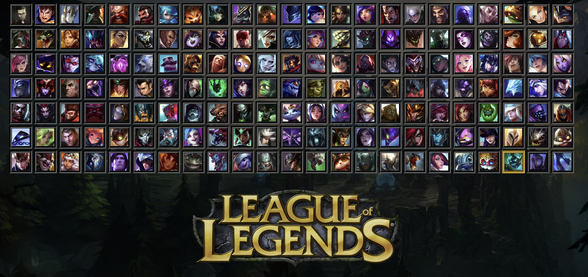
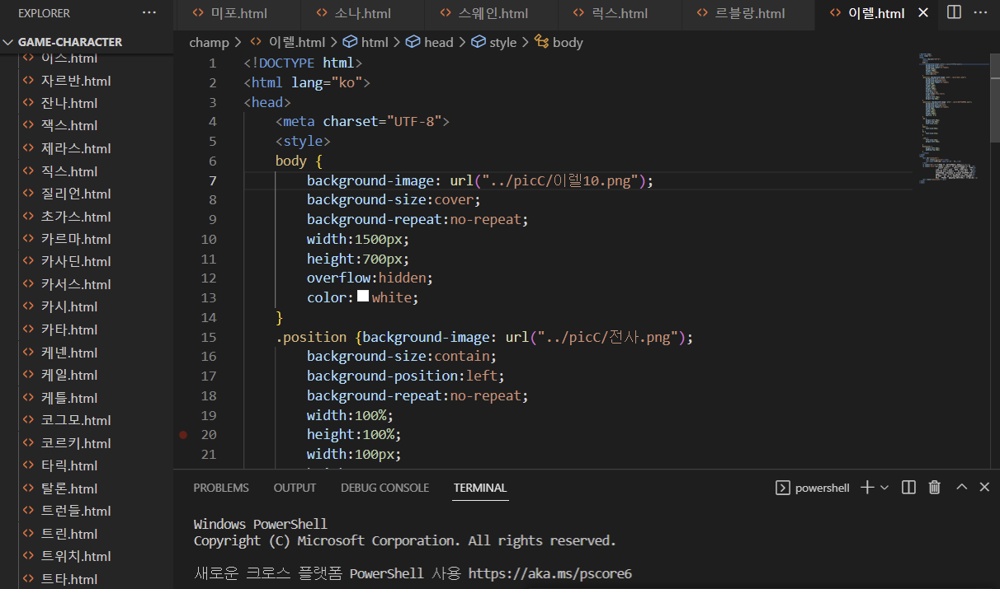
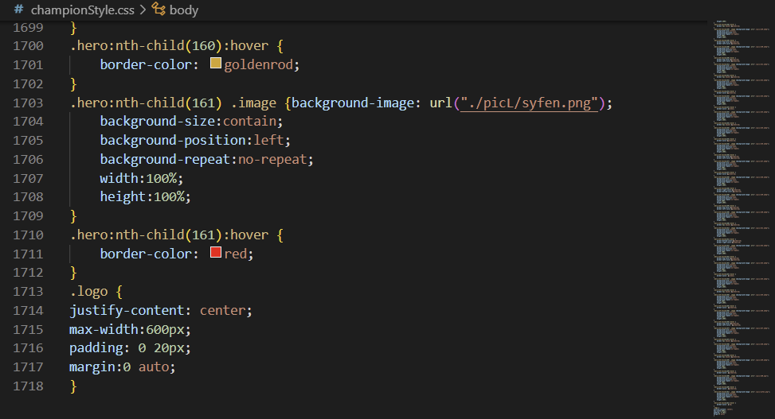

## **2022년 6월 24일**

시험기간에 다른 공부를 하는 것이 너무나도 재밌다. 물론 내가 지금 만들고있는 웹사이트는 거의 단순 노가다지만...  
내가 개인적으로 만들고 있는 웹사이트는 PC AOS 게임인 리그 오브 레전드와 관련된 웹사이트이다. 평소 즐겨 하기도 하고,  
관심이 있기도 해서 만들어보았다.

이런 식으로 게임 내 다양한 캐릭터들을 모두 작은 아이콘으로 띄워서 목록창을 만들고, 클릭하면 설명이 나오게 하는 구조다.  
캐릭터 창 하나하나마다 커스터마이징을 세부적으로 해주다보니 CSS의 코드가 1700줄이 넘게 되었다.. 뭔가 뿌듯하면서도 뿌듯  
하지않은 그런 느낌이 들었다. 클릭할 때에는 새로운 웹사이트로 이동시켜 캐릭터를 설명하는 창을 띄워야 하기에, 창을 캐릭터  
의 개수에 맞게 160개를 만들었어야했다. 너무 심한 노동인데도 나는 이런 활동이 공부에 있어서 도움이 되는 활동이라고는 잘  
생각하지 못하겠으나, 개발자가 되는 발전 단계에 있어 언젠가는 꼭 경험해보아야되는 일이었다. 개발자가 되서 실무에 투입되면,  
이 일은 상상도 할 수 없는 많은 일들이 생길 수 있기 때문이다.  

그렇게 내 프로젝트를 빠르게 마치고 나서는, 아직 제출하지 않은 몇 가지 과제들을 제출하고 학교 공부가 아닌 자기계발에 온  
힘을 다해 집중하려한다. 친구는 벌써 시험기간이 끝나지 않았는데도 CS 공부를 시작하여 브라우저의 기능을 독학하고 있는 것을  
보고, 나도 지금 내가 하고있는 프로젝트나 과제들을 더 질질 끌지 않고 빨리 끝내서 공부를 시작해야겠다는 동기부여가 되었다.  
최근에 내 깃허브 메인의 자기소개 파일도 흥미로운 기능들을 추가해서 디자인을 전보다 풍요롭게 새로 리모델링하여 커밋하였다.  

예전에는 깃허브를 커밋할 때에 CLI를 사용했지만, 요즘은 에러가 나는 것들에 대해 힘들고 지쳐서 몇 달 전부터 학교 선배가 알  
려주신 GUI를 사용하여 커밋하는 방법으로 깃허브를 관리하고있다. 이런 점에서는 GUI를 사용하는 커밋이 정말 편리하긴 하지만,  
단점은 효율적인 버전 관리가 되지 않는 것이었다. 그래서 자기계발을 하며 시간이 남을 때에는, 책을 빌려 깃허브 공부를 다시  
시작해서 CLI를 사용하는 개발자로서 좋은 습관을 들이려고 노력해야겠다. 